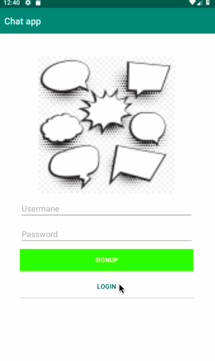

# Android Chat App *

**TwitterClone** is an simple android chat app 

Time spent: **2** hours spent in total

## User Stories

The following functionality is completed:

- [x] User can **sign in ** using using Parse
- [x]	User can **Log in** using Parse
- [x] User can write a message and send it
- [x] User can view all the messages from other users
- [x] Current logged in user is persistant

## Video Walkthrough

Here's a walkthrough of implemented user stories:

GIF created with [LiceCap](http://www.cockos.com/licecap/).
